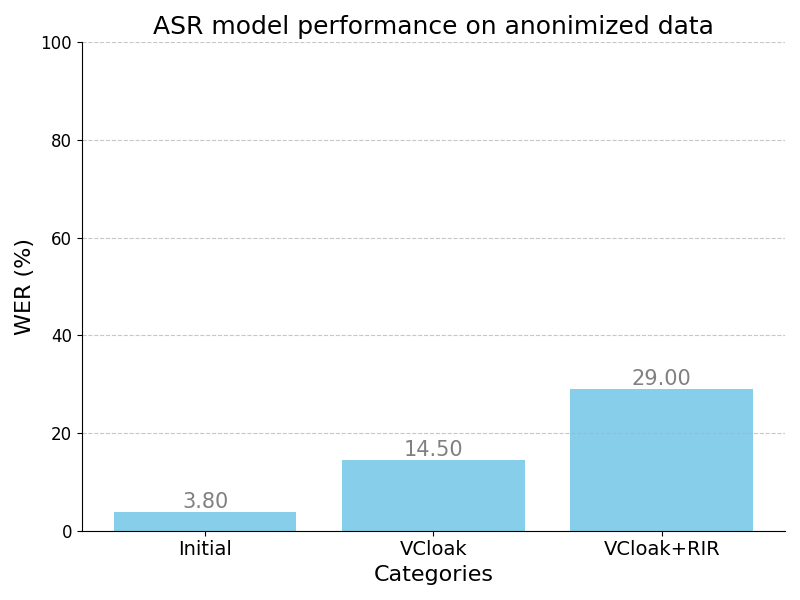
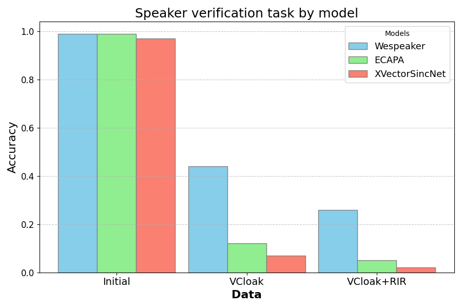

The modified source code of V-Cloak.

Original code is taken from here: https://github.com/V-Cloak/V-Cloak

Weights after training (43 epoch ~ 43h on A100) are located at [Google Drive](https://drive.google.com/file/d/18a9uxaoJKU6JEB_SFGv7YFLnOGp865Oo/view?usp=drive_link)

Audio samples after anonimization are located at [Google Drive](https://drive.google.com/file/d/1osN5d8TXyg8HsBkdaDN8KlDwn3xpqgVb/view?usp=sharing)

Audio samples after anonimization and RIR are located at [Google Drive](https://drive.google.com/file/d/1KIBR0mT3hnM9Wm8nxtTVLZckx2z4QE-E/view?usp=sharing)

## Files and Directories

- **VCloak_test.ipynb:** Jupyter notebook implementing the cosine similarity accuracy calculation using ECAPA-TDNN, Wespeaker and XVectorSincNet models; WER metrics calculation using S2T model.
- **RIR.ipynb:** Jupyter notebook implementing the Room Impulse Responce calculation as an additional noise.
- **Graphs.ipynb:** Jupyter notebook containing data and plots from tests conducted using all implemented methods and models.

## Usage
- Each Jupyter notebook contains implementations of specific methods on different datasets and network architectures. Users can run these notebooks to see the results and comparisons.
- The `V-Cloak/Datasets` directory contains datasets used in the project. Users can add their own datasets if needed.
- The `V-Cloak/model_checkpoint_GPU` directory contains saved training checkpoints.

## Dependencies
- This project uses PyTorch for deep learning implementations.
- You may find a list of the necessary packages in `V-Cloak/requirements.txt` file and in .ipynb import cells.


## Project structure

```shell
|--Pics
|--Samples
|--V-Cloak
|  |-- Datasets
|  |-- ECAPA
|  |   |-- classifier.ckpt
|  |   |-- embedding_model.ckpt
|  |   |-- hyperparams.yaml
|  |   |-- label_encoder.ckpt
|  |   |-- mean_var_norm_emb.ckpt
|  |-- XVECTOR
|  |   |-- classifier.ckpt
|  |   |-- embedding_model.ckpt
|  |   |-- hyperparams.yaml
|  |   |-- label_encoder.ckpt
|  |   `-- mean_var_norm_emb.ckpt
|  |-- model_checkpoint_GPU
|  |   `-- _VCloak_CheckPoint_newest
|  |-- deepspeech4loss_original.py
|  |-- deepspeech4loss.py
|  |-- ecapa_tdnn_test.py
|  |-- masker.py
|  |-- model
|  |   |-- conv.py
|  |   |-- crop.py
|  |   |-- resample.py
|  |   |-- utils.py
|  |   |-- waveunet4val.py
|  |   `-- waveunet.py
|  |-- new_pytorch_deep_speech_original.py
|  |-- new_pytorch_deep_speech.py
|  |-- requirements.txt
|  |-- train.py
|  |-- trainingDataset.py
|  `-- validation.py
|--Graphs.ipynb
|--RIR.ipynb
`--VCloak_test.ipynb
```


## Results
- Detailed results and comparisons can be found in the `Graphs.ipynb` notebook.

Below are the barplots illustrating the model performance comparisions: 

1. **ASR model performance on anonimized data**

<p align="center">

2. **Speaker verification task by model**

<p align="center">
